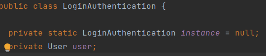

# Design Rationale

## SOLID Principles

### Single Responsibility Principle

Each of the classes are only responsible for their functionalities within the system. This allows
for loose coupling and changes to each class without affecting other classes in tandem. For example,
changes to a `Receptionist` class will not affect the functionalities of `Patient` or `Customer`
class

### Dependency Inversion Principle

The lower level classes depends on the higher level classes by inverting their dependencies. By
inverting their dependencies, the abstract logic of our system no longer depends on the details of
our system, but rather the other way round. This allows for more flexibility to refactor our codes
or add new features to the lower level modules without changing the codes in it's dependencies as
one will if the dependency is not inverted. This is because now both the lower level and higher
level modules depends on the same abstraction. Also, with now the higher level modules no longer
depends on the details, it makes for easier reuse of the higher level modules.

An example of this will be:

\
*Figure 1. Abstract User Class*

\
*Figure 2. Lower Level module depending on the abstract class*

## Package Level Principles

### The Release Reuse Equivalency Principle (RREP)

An `Exception` package is released as it is meant to be reused in our system.

TODO: Image for package

### The Common Closure Principle (CCP)

We have 4 separate packages in our system that adheres to ths principle, `UserPackage`
, `TestingFacilityPackage`,`LoginSystemPackage`and `BookingPackage`.

Any changes inside any of the classes inside these packages will also affect all of the other
classes inside the packages but no other packages shall be affected.

The reason this principle is adhered to is because as programmers, maintainbility is the key to good
code practices and we want to ensure that changes or refactoring that occurs in those packages are
closed only to that packages being modified. This would allow simplification in our tasks if we have
to change the classes inside these packages without worrying about other packages. Had we not
adhered to this principle, each small change would need to be revalidated in every other packgages
to avoid any breaking changes.

For example, changes in one of the class in `User` package will only affect other classes in `User`
package.

However, it is not always possible to maintain a full closure, as some of these packages are also
used in other packages therefore may require changes in them.

A potential con of this principle is clients using our packages may find it hard to reuse our
packages as they may find our packages not to be useful but we are confident that we maintained a
balance between the size of our packages.

## Package Coupling Principles

### The Acyclic Dependencies Principle (ADP)

