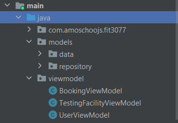
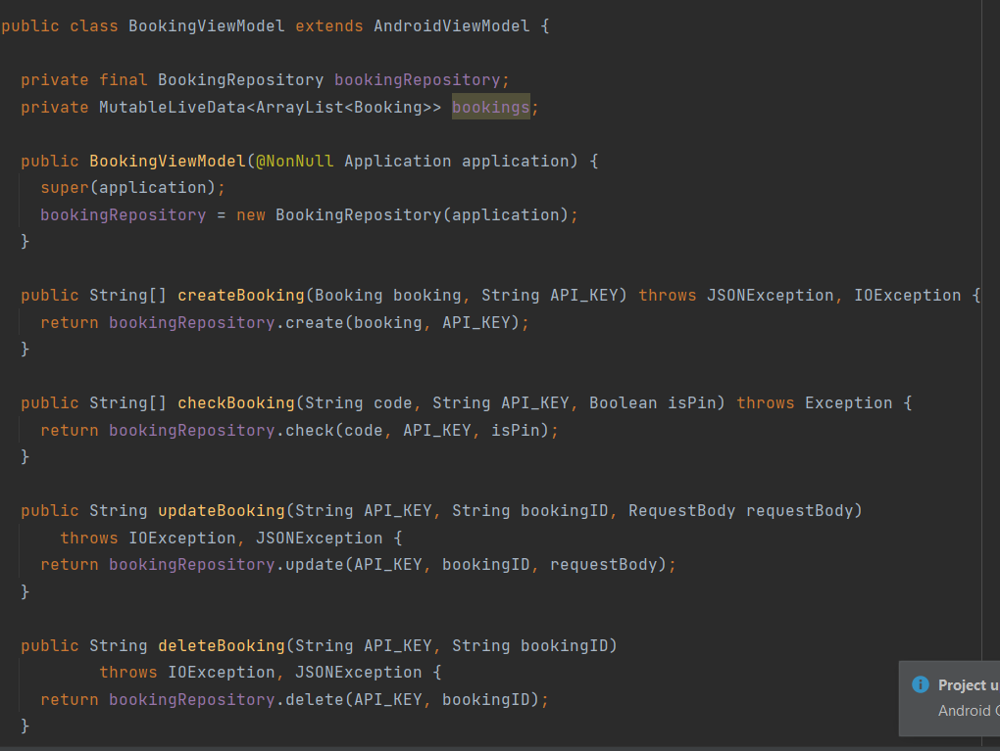
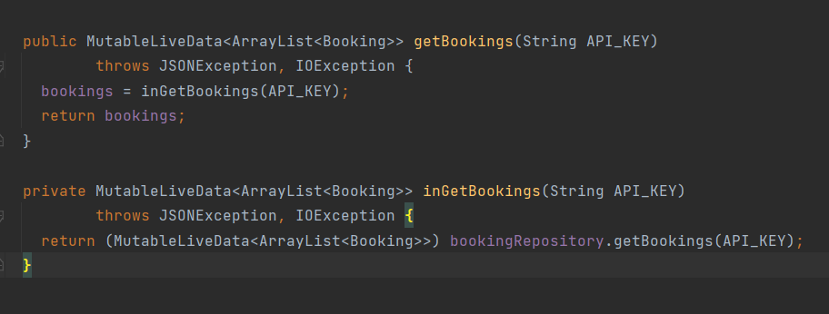
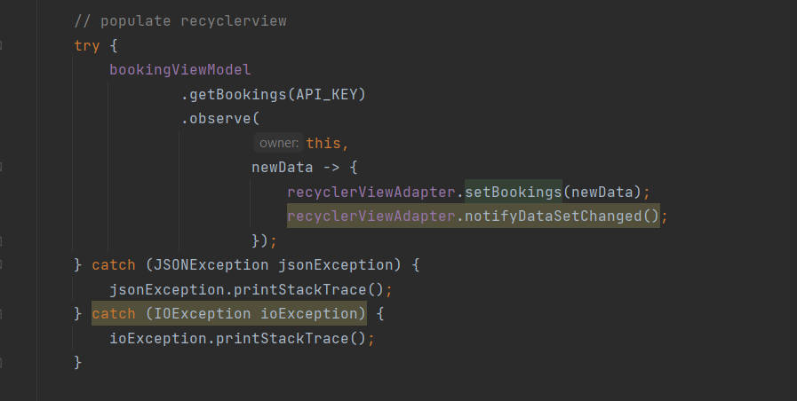

# Assignment 3 Design Rationale Updates

## Architecture Changes

In Assignment 2, our system used to run in Android application. Therefore by default, our
architecture is modelled as Model View Architecture(MVC) pattern with
the [XML](app/src/main/res/layout) files being the View,
the [Activity](app/src/main/java/com/amoschoojs/fit3077) files being the Controller and the
remaining files in the Java directory being the Model in our architecture. However, for this
assignment, we decided to refactor our architecture into Model-View-ViewModel(MVVM) pattern. There
are two main reasons we decided to refactor into MVVM pattern. First, MVC pattern is more commonly
used in web applications therefore the MVC pattern for Android systems is not well defined as
compared to web applications. Too often, in Assignment 2, we are confused about the logic placement
of the codes, for example we need to show a Android Dialog when user making a booking, in a well
defined MVC pattern, the dialog should be defined in the View part, but for Android it must be
defined in the (Activity)Controller class. It causes a huge failure on separation of concerns
because neither the View or the Controller is separated. With a MVVM architecture, both the XML
files and Activity class are considered as View now.

In MVVM, the View holds a reference to the ViewModel therefore allowing us to put some logic into
View without overcomplicating the ViewModel part of it. As compared to MVC, separation of concerns
is difficult, we run the risk of making the Controller as GOD classes. With MVVM used here in
Android applications, they are separated into different layers, with View being at the top,
ViewModel below it and the Model at the very bottom of it. With this, our code remains extensible
and reusable since the logics are now well defined at each layer thus also making debugging and
testing easier.

One disadvantage we considered is the size and complexity of our project. MVVM is usually more
structured towards large and complex application therefore it may not be worth it to use MVVM
architecture for this project but at the end we decided to because of the benefits told earlier

\
*Figure 1. Updated Architecture pattern*

## Design Patterns

### Removal of Booking Facade

In Assignment 2,we implemented Booking Facade design pattern for the client to make Bookings. With a
facade design pattern, client can just use the BookingFacade to simplify the booking process.
However, we found out that after refactoring our architecture to MVVM, BookingFacade design pattern
is not needed anymore. This is because the ViewModel now acts as an abstraction layer between the UI
code and the actual Model data class itself. In the View, we would just instantiate a
BookingViewModel instance and the BookingViewModel acts as a middleware between the Repository and
the UI. In essence, BookingViewModel now holds the methods of a BookingFacade class.

\
*Figure 2. BookingViewModel class*

### Memento Pattern

### Observer Pattern

In Android MVVM architecture, Observer pattern can be applied easily using Android. LiveData is an
observable data holder
class [source](https://developer.android.com/topic/libraries/architecture/livedata). We used
LiveData to easily observe changes in our booking details. This is also part of the reason we
decided to refactor to MVVM architecture due to LiveData. Our initial design in Assignment 2
supported implementing the Observer pattern but since Android provides an abstraction in LiveData
itself, we just had to apply LiveData to observe changes. Without MVVM architecture in place, we
would most likely added additional complexity to our system design in Assignment 3 such as making
new interfaces and observer classes. With our MVVM refactoring, we can largely use our design from
Assignment 2 without any major changes.

In our use case, we used Observer pattern to refresh the UI each time a booking has changed or
cancelled.
\
*Figure 3. LiveData returned in methods in BookingViewModel class*

As in Figure 3, we can see LiveData is returned from the BookingRepository instead of a normal
ArrayList

\
*Figure 4.Our View class leveraging BookingViewModel to get livedata and observe them*

As noticed above, the simplicity of applying Observer pattern is extremely simplified by Android
LiveData. We would just have to retrieve the bookings from the ViewModel, then just leverage
the `observe` method provided in an Android LiveData. And once this `observe` is triggered, we can
just refresh our View in the UI easily.