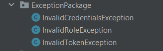
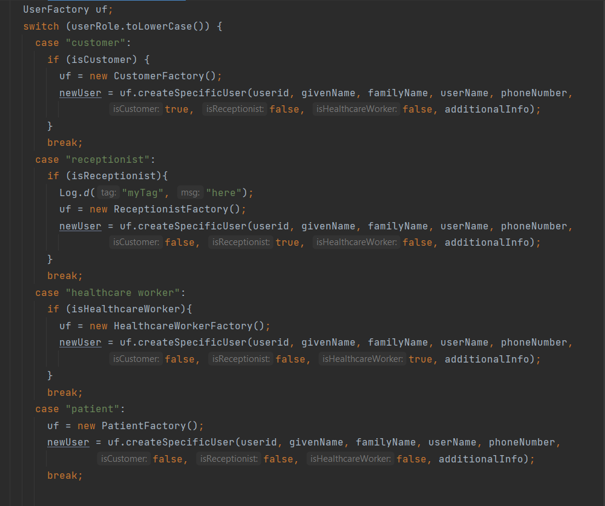
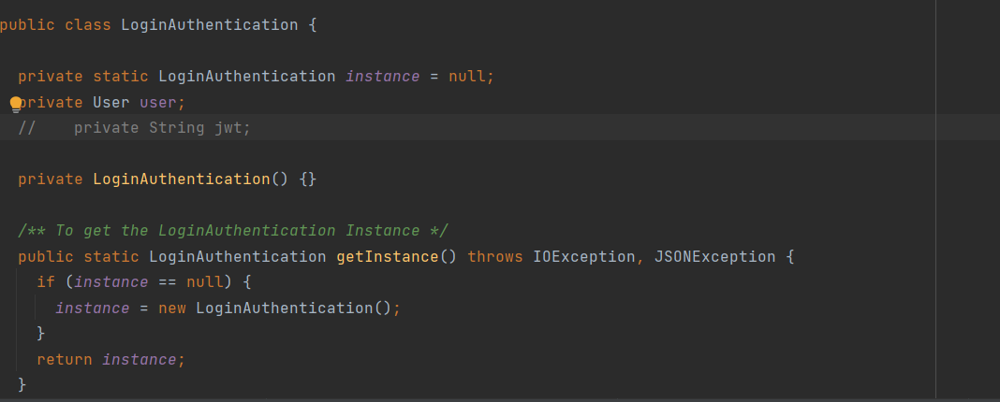
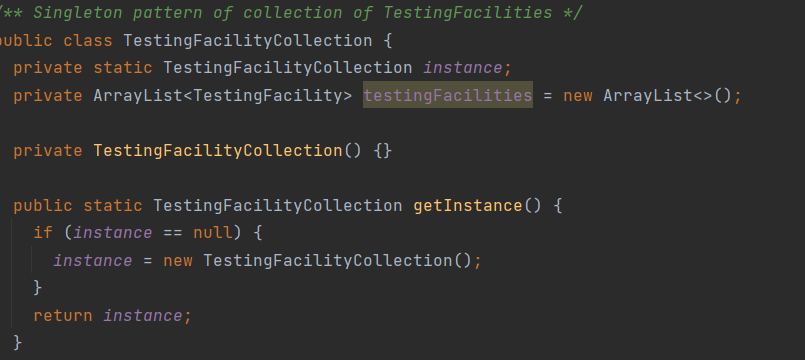
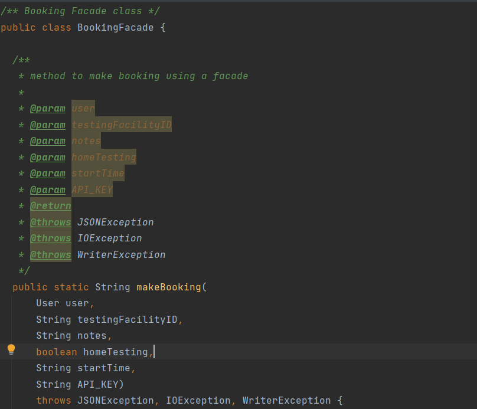

# Design Rationale

## SOLID Principles

### Single Responsibility Principle

Most of the classes are only responsible for their functionalities within the system. This allows
for loose coupling and changes to each class without affecting other classes in tandem. For example,
changes to a `Receptionist` class will not affect the functionalities of `Patient` or `Customer`
class

### Dependency Inversion Principle

The lower level classes depends on the higher level classes by inverting their dependencies. By
inverting their dependencies, the abstract logic of our system no longer depends on the details of
our system, but rather the other way round. This allows for more flexibility to refactor our codes
or add new features to the lower level modules without changing the codes in it's dependencies as
one will if the dependency is not inverted. This is because now both the lower level and higher
level modules depends on the same abstraction. Also, with now the higher level modules no longer
depends on the details, it makes for easier reuse of the higher level modules.

An example of this will be:

\
*Figure 1. Abstract User Class*

\
*Figure 2. Lower Level module depending on the abstract class*

## Package Level Principles

### The Release Reuse Equivalency Principle (RREP)

An `Exception` package is released as it is meant to be reused in our system.

\

### The Common Closure Principle (CCP)

We have 4 separate packages in our system that adheres to ths principle, `models.data.UserPackage`
, `models.data.TestingFacilityPackage`,`models.data.LoginSystemPackage`
and `models.data.BookingPackage`.

Any changes inside any of the classes inside these packages will also affect all of the other
classes inside the packages but no other packages shall be affected.

The reason this principle is adhered to is because as programmers, maintainability is the key to
good code practices and we want to ensure that changes or refactoring that occurs in those packages
are closed only to that packages being modified. This would allow simplification in our tasks if we
have to change the classes inside these packages without worrying about other packages. Had we not
adhered to this principle, each small change would need to be revalidated in every other packgages
to avoid any breaking changes.

For example, changes in one of the class in `User` package will only affect other classes in `User`
package.

However, it is not always possible to maintain a full closure, as some of these packages are also
used in other packages therefore may require changes in them.

A potential con of this principle is clients using our packages may find it hard to reuse our
packages as they may find our packages not to be useful but we are confident that we maintained a
balance between the size of our packages.

## Package Coupling Principles

### The Acyclic Dependencies Principle (ADP)

We have maintained our packages in a way such that there are no cycles between our packages. This is
achieved through dependency inversion principle mainly as we made the lower level classes inside the
package depend on the higher level class, while the classes inside the other packages will also
depend on the higher level class inside the earlier package therefore avoiding a cycle between these
two packages.

An example is from above, where we applied dependency inversion principle
on `models.data.UserPackage`
and `models.data.LoginSystemPackage`, thereby also avoding cyclic dependencies between the packages.

The reason we want to avoid cycles between our packages is because we want to avoid tight coupling
between these packages which we want to avoid. Also, if any minor changes in these packages will
cause potential errors and bugs, if the programmers do not inspect all the remaining cyclic
dependencies between these packages. It may also cause trouble if there is a domino effect between
the packages where one change inside a package leads to another and so on which waste a lot of the
programmers time.

## Software Design Patterns

### Factory Method

\
*Figure 3. Example of Factory method pattern applied*

We applied Factory method in our system, specifically the functionality to create a User, when a
user logined to our system. The system is able to have multiple type of user login to our system
such as customers, receptionist and healthcare workers. A factory method provides an interface to
create a `User` object in our system while also allowing subclasses of `User` such as `Receptionist`
and `Customer`. This allows us to pass respective user roles object into our client directly without
our client worrying on what User subclasses object they should create.

This is because we do not know what type of `User` someone is going to login to our system
beforehand therefore making the Factory method design pattern useful to our system. With this, we
also avoid a tight coupling between the creator (`UserFactory`) class and the concrete classes. One
disadvantage of this pattern is that we have to introduce multiple subclasses which introduces more
complexity to our backend system.

### Singleton

We also make use of the Singleton design pattern in our system, `LoginAuthentication` class
and `TestingFacilityCollection`

\
*Figure 4. Singleton pattern applied to LoginAuthentication*

\
*Figure 5. Singleton pattern applied to TestingFacilityCollection*

For `LoginAuthentication`, it is wise to use a singleton pattern as the application will only have
one instance of `User` at all time. A singleton pattern is used over a global variable because a
global variable does not prevent multiple instances for an object to be created.

The same reasoning is applied to 'TestingFacilityCollection` class, at any point in time, there will
be only one instance of a TestingFacilityCollection object. Since our application is single
threaded, we have no issues with using the Singleton pattern design.

A trade off of using Singleton pattern design is it violates the `Single Responsiblity Principle`.

### Facade

\
*Figure 6. Facade pattern applied to Booking Subsystem*

We applied a Facade design pattern in our system, specifically in our `Booking`subsystem. With a
facade design pattern, we have provided a simple interface for the clients to use without worrying
about the internal implementation of the subsystem. This provides an abstraction for the client
interface to our complex `Booking`subsystem. Our complex subsystem involves several methods of
Booking involving `HomeBooking` and `OnSiteBooking` and there are 3rd party dependencies needed to
implement the `HomeBooking` subsystem QR code. With these facade pattern, the interface to make a
booking is largely simplified for the client.

We also considered Strategy design pattern instead of Facade but decided against it because we have
covered all exhaustive cases of possible booking scenarios which are not a lot in the first place
and we did not feel a need to overcomplicate our system with too many classes and interface. Also,
with a Facade design pattern, they do not need to know what strategy to apply as opposed to a Facade
design pattern.

# Assignment 3 Design Rationale Updates

## Architecture Changes

In Assignment 2, our system used to run in Android application. Therefore by default, our
architecture is modelled as Model View Architecture(MVC) pattern with
the [XML](app/src/main/res/layout) files being the View,
the [Activity](app/src/main/java/com/amoschoojs/fit3077) files being the Controller and the
remaining files in the Java directory being the Model in our architecture. However, for this
assignment, we decided to refactor our architecture into Model-View-ViewModel(MVVM) pattern. There
are two main reasons we decided to refactor into MVVM pattern. First, MVC pattern is more commonly
used in web applications therefore the MVC pattern for Android systems is not well defined as
compared to web applications. Too often, in Assignment 2, we are confused about the logic placement
of the codes, for example we need to show a Android Dialog when user making a booking, in a well
defined MVC pattern, the dialog should be defined in the View part, but for Android it must be
defined in the (Activity)Controller class. It causes a huge failure on separation of concerns
because neither the View or the Controller is separated. With a MVVM architecture, both the XML
files and Activity class are considered as View now.

In MVVM, the View holds a reference to the ViewModel therefore allowing us to put some logic into
View without overcomplicating the ViewModel part of it. As compared to MVC, separation of concerns
is difficult, we run the risk of making the Controller as GOD classes. With MVVM used here in
Android applications, they are separated into different layers, with View being at the top,
ViewModel below it and the Model at the very bottom of it. With this, our code remains extensible
and reusable since the logics are now well defined at each layer thus also making debugging and
testing easier.

One disadvantage we considered is the size and complexity of our project. MVVM is usually more
structured towards large and complex application therefore it may not be worth it to use MVVM
architecture for this project but at the end we decided to because of the benefits told earlier

\
*Figure 7. Updated Architecture pattern*

## Design Patterns

### Removal of Booking Facade

### Memento Pattern

### Observer Pattern